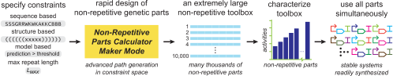

<h1 align="center">
    
</h1>

  <a href="#Overview">Overview</a> •
  <a href="#installation">Installation</a> •
  <a href="#license">License</a> •
  <a href="#contributing">Citation</a> •
  <a href="#acknowledgements">Documentation</a> 

## Overview

Engineering large genetic circuits, pathways and whole genomes require large toolboxes of well characterized genetic parts. Existing toolboxes for composing such genetic systems from scratch are either small (forcing designers to re-use the same part at multiple locations) and/or frequently share many repeats. Systems composed of repetitive elements are challenging to synthesize – leading to incomplete or mixed products. When a repetitive genetic system introduced in a host organism causes biochemical stress, the cell may respond with homologous recombination – sections of the system are deleted, effectively breaking it.  In _E. coli_, a `20`-bp repeat is enough  to detectable levels of recombination.

To solve this _repeat challenge_ in synthetic biology, we developed and experimentally validated a suite of algorithms that automatically discovers and designs large toolboxes of highly non-repetitive genetic parts, collectively called the `Non-Repetitive Parts Calculator`. In `Finder Mode`, the algorithm discovers subsets of non-repetitive genetic parts from an existing toolbox, while in `Maker Mode`, the algorithm designs large toolboxes of non-repetitive genetic parts for downstream characterization, based on specified design constraints such as a degenerate `DNA` or `RNA` sequence, an `RNA` secondary structure, and/or arbitrary model-based criteria.

Non-repetitiveness is a global property of the entire genetic part toolbox, and it is quantified by a repeat distribution (the number of repeats of length `L`) or more simply by the maximum shared repeat length, `Lmax`.  Both algorithms generate toolboxes according to a user-specified  `Lmax`  to control the desired level of non-repetitiveness. For example, when a toolbox of genetic parts is designed using an  `Lmax` of `10` base pairs, every genetic part in the toolbox can be simultaneously utilized in the same genetic system without introducing a repetitive sequence longer than `10` base pairs, which is necessary to ensure successful `DNA` synthesis and assembly.

<h3 align="center">
    
</h3>
